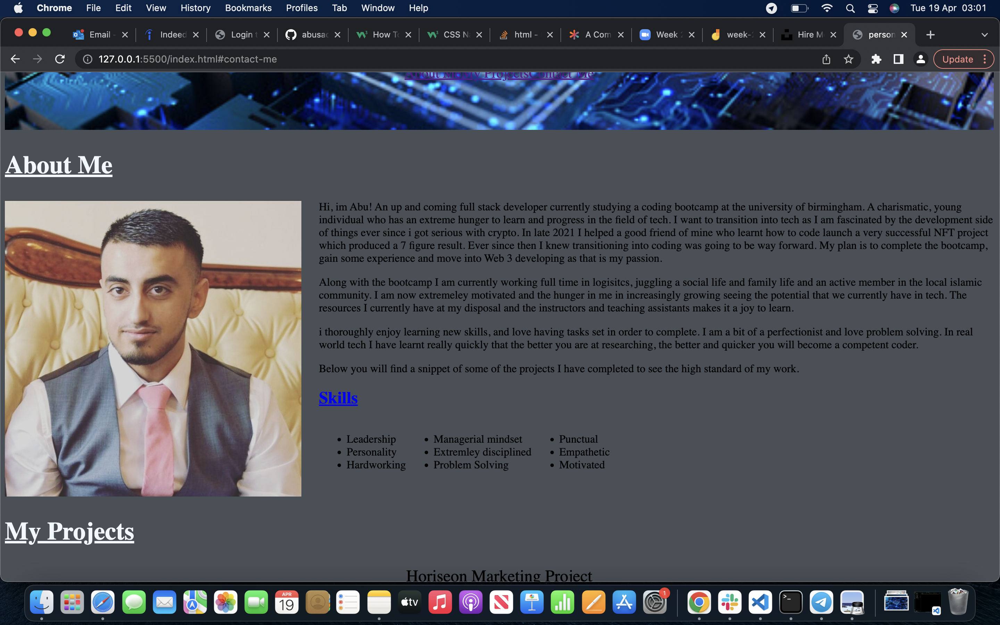
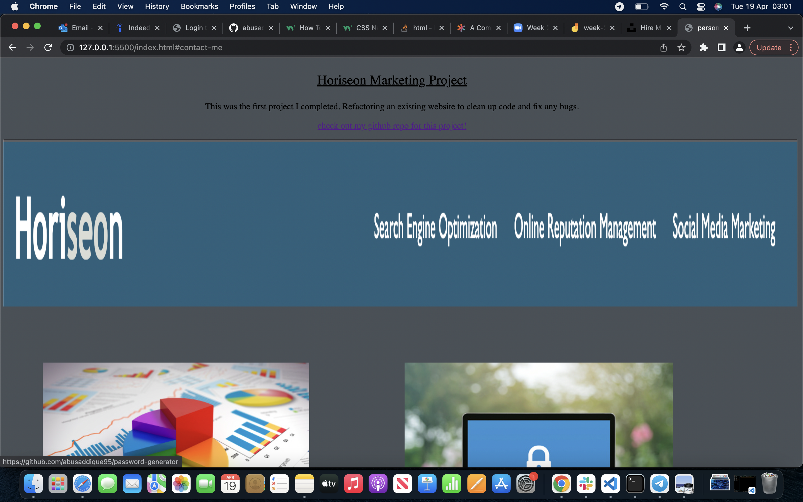
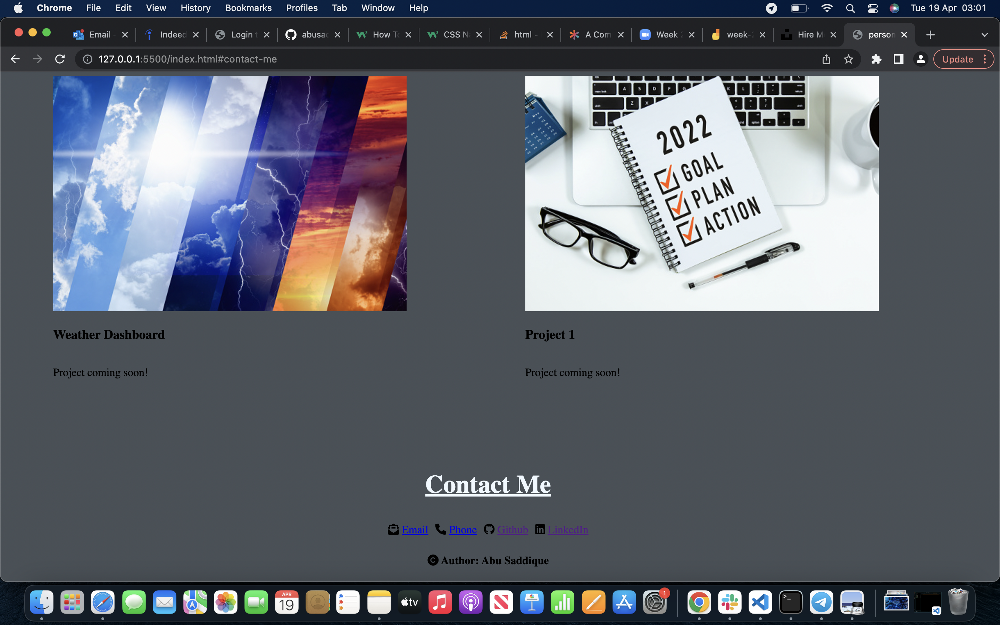
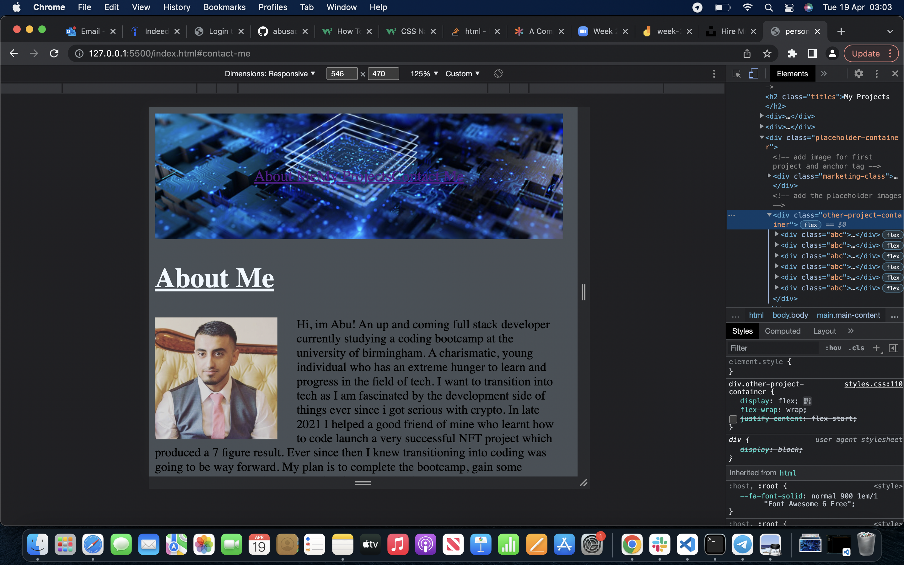
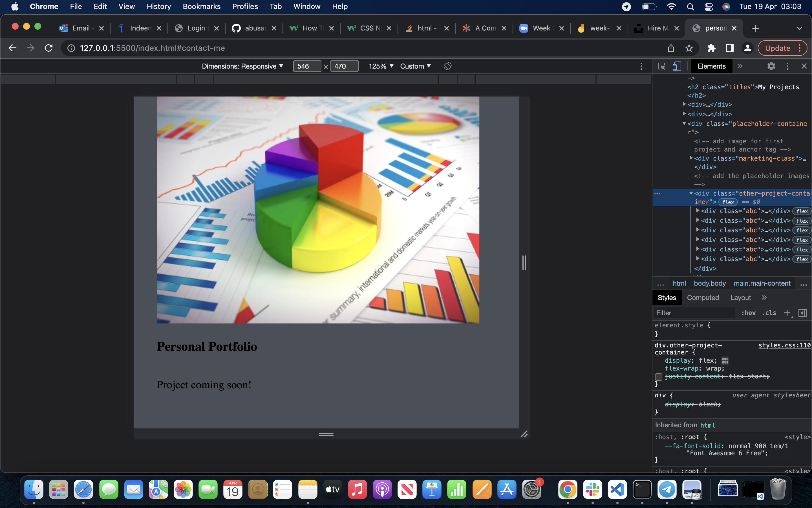
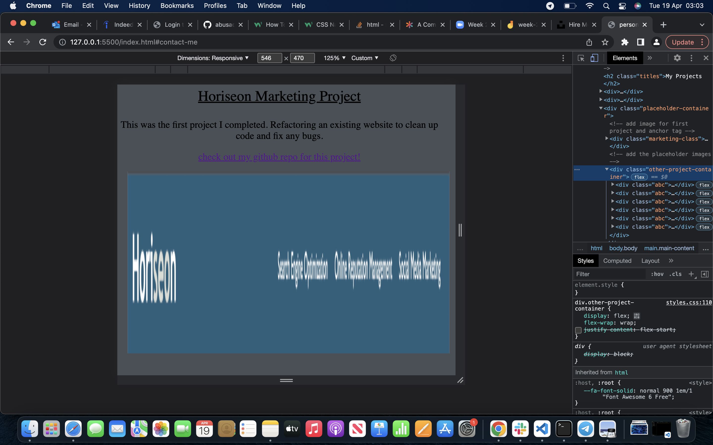
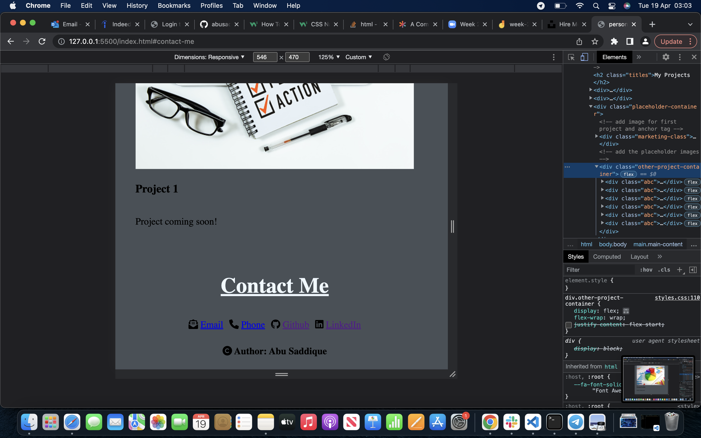

# personal-portfolio-project

A personal portfolio to showcase the projects i have done on my programming journey

## Deployed URL

https://abusaddique95.github.io/personal-portfolio-project/

## Technologies

Unsplash.com
Coolors.io
Fontawsome.com
Github
HTML
CSS

## HTML

Created a skeleton body containing a header, body and footer. Within the header, added a nav bar navigating to the corresponding sections.

in the body we created 3 main sections for the content of the portfolio, the images included anchor tags taking the user to the corresponding github repos of the projects.

## CSS

Used CSS to style the nav bar with a background image. Also to derive classes and make the first project bigger than the subsequent projects.

Styled the font sizes, borders, margins.

Used flex containers and flex items to position items correctly in rows or columns.

used media screen and flex items to make the website responsive to both mobile and desktop view ports

## Screenshots

## Mobile Screenshots

## About Me

A young up and coming web developer, you can contact me on abusaddique95@live.com
