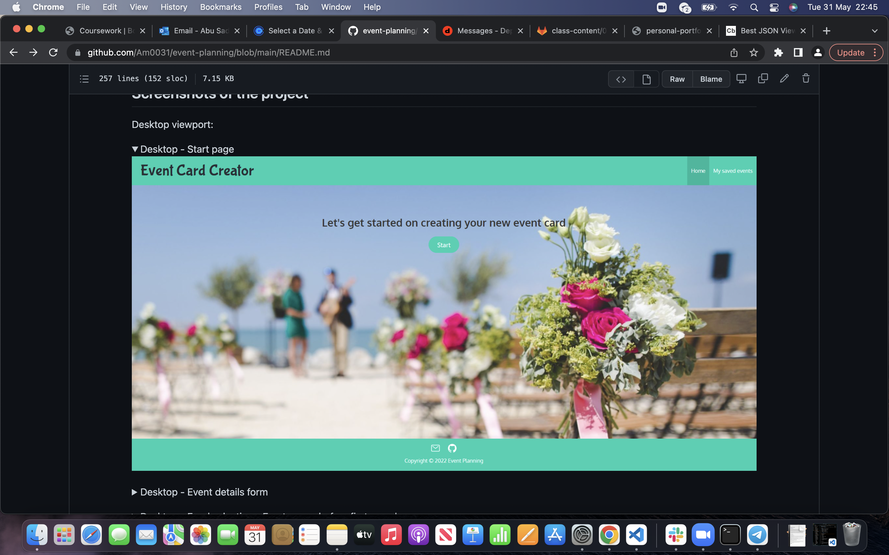

# personal-portfolio-project

A personal portfolio to showcase the projects i have done on my programming journey

## Deployed URL

https://abusaddique95.github.io/personal-portfolio-project/

## Technologies

Unsplash.com
Coolors.io
Fontawsome.com
Github
HTML
CSS

## HTML

Created a skeleton body containing a header, body and footer. Within the header, added a nav bar navigating to the corresponding sections.

in the body we created 3 main sections for the content of the portfolio, the images included anchor tags taking the user to the corresponding github repos of the projects.

## CSS

Used CSS to style the nav bar with a background image. Also to derive classes and make the first project bigger than the subsequent projects.

Styled the font sizes, borders, margins.

Used flex containers and flex items to position items correctly in rows or columns.

used media screen and flex items to make the website responsive to both mobile and desktop view ports

## Screenshots

## Mobile Screenshots

## About Me

A young up and coming web developer, you can contact me on abusaddique95@live.com

## Password Generator project

starter code was given, i added functions, arrays and loops in order to generate a random password between 8 and 128 characters. In order to return a password between those parameteres I used if statements, and an else statement alerting them if they had not met the required criteria.

## code quiz

used javascript to dynamically render the HTML elements and have functions be called on load of the page. local storage was initialised in order to save the functions which were entered into the planner.

functions were created and called in order to run the page smoothly. sections were removed and new sections appeared to make it look like a smooth transition.

a timer was added and counted down once the quiz started. if a question was answered incorrectly it would deduct 5 seconds from the time.

certain functions were called if the timer ran out or a form was rendered if the quiz was completed before. scores were saved in local storage.

This project was notably the hardest project to date. It called for me to call everything i have learnt and put it all together in order to finish the project.

## Project 1 - Event Planning

Event Card creator - this project takes the user through steps to create their event card. The user enters information about their event details on a form, selects their chosen food and music and all their information is then rendered on an event card template that they can print.

The created events are saved in local storage and the user can consult and edit them by going on the "My Saved Events" page.

Team members

Smeea Arshad
Gurmanpreet Nagra
Amelie Pira
Abu Saddique
Aisha Saleh
Nayan Sharma

Links to the project
Deployed URL: https://am0031.github.io/event-planning/

Github repository: https://github.com/Am0031/event-planning

This was the first group project we contstructed. We first developed a detailed wireframe on how we wanted the HTML to look as we knew once we had a clear vision it was easy to work towards that. Once that was completed we used the github projects to create tickets and assign ourselves tasks. Being a part time course, everyones availability was different so we created a list of tickets and whoever was free would pick up the tickets and start the work, once somebody assigned themselves a branch to reduce merge conflicts we recommended to ourselves that one person stays on that branch till it was ready to be merged to master.

This is a screenshot of our wireframe, as you can see it is detailed and we followed it explicitly as we were confident in our design.

This was the landing page of our final application. We decided to go with a lighter colour scheme to bring it to life.
